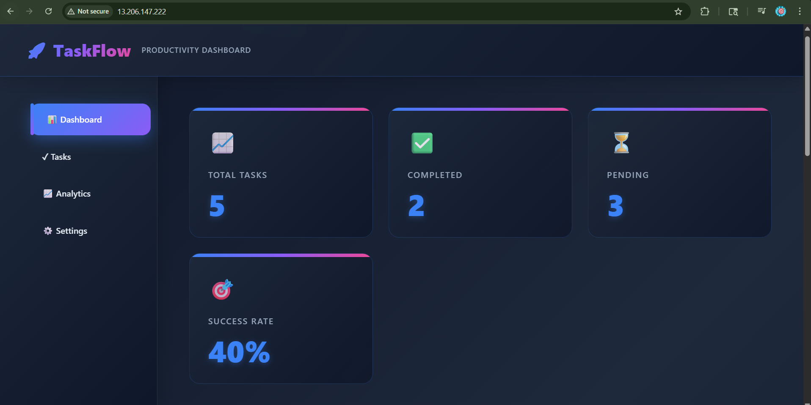
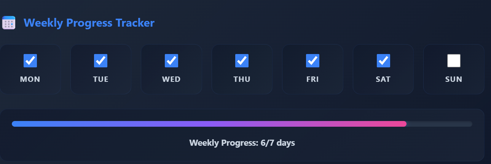
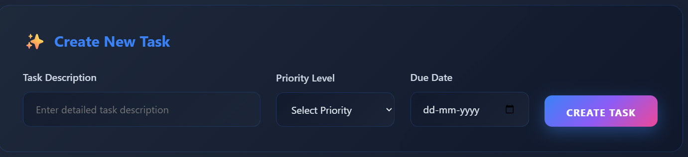
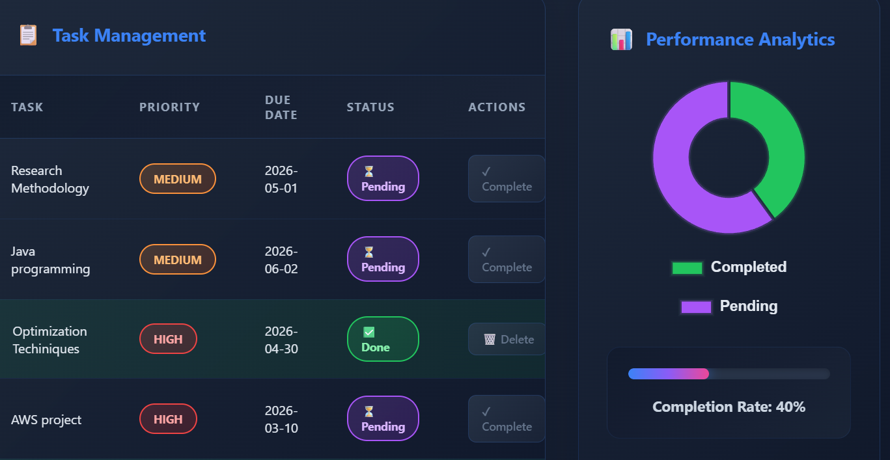

# 🚀 TaskFlow – SaaS Task Management Dashboard

## 🌐 Live Demo

👉 http://13.206.147.222

---

## 📌 Project Overview

TaskFlow is a **cloud-based task management dashboard** built using a LAMP stack and deployed on AWS Lightsail.

It helps users:

* Manage daily tasks
* Track productivity
* Visualize progress
* Monitor weekly consistency

---

## ⚙️ Tech Stack

* **Frontend:** HTML, CSS, Bootstrap
* **Backend:** PHP (mysqli)
* **Database:** MariaDB
* **Cloud:** AWS Lightsail (Bitnami LAMP)
* **Charts:** Chart.js

---

## ✨ Features

* ✅ Add / Complete / Delete tasks
* 📊 Dashboard with real-time stats
* 📅 Weekly progress tracker (localStorage based)
* 📈 Analytics with Chart.js
* 🎨 Modern SaaS UI (dark theme + gradients)
* ☁️ Live cloud deployment

---

## 📸 Screenshots

> Below are real screenshots of the deployed application

### 📊 Dashboard



### 📅 Weekly Tracker



### 📋 Task Management



### 📈 Analytics



---

## 🗂️ Project Structure

```text
taskflow/
│── index.php
│── db.php
│── setup.php
│── style.css
│── README.md
│── .gitignore
│── screenshots/
```

---

## 🛠️ Setup Instructions

1. Clone the repository:

```bash
git clone https://github.com/DXorganization-spec/taskflow.git
cd taskflow
```

2. Configure database in `db.php`

3. Run setup:

```text
http://your-ip/setup.php
```

4. Open application:

```text
http://your-ip/index.php
```

---

## ☁️ Deployment

* Hosted on AWS Lightsail using Bitnami LAMP stack
* Code deployed via GitHub (git pull)

---

## 🧠 Architecture

This project uses a **LAMP architecture**:

* Linux
* Apache
* MariaDB
* PHP

---

## 🎯 Learning Outcomes

* Cloud deployment on AWS
* Full-stack development
* Database integration
* Real-world debugging
* GitHub version control

---

## 👨‍💻 Author

**Aditya Satpute**
GitHub: https://github.com/DXorganization-spec

---

## ⭐ Note

This project demonstrates a real-world SaaS-style dashboard with cloud deployment and modern UI design.
